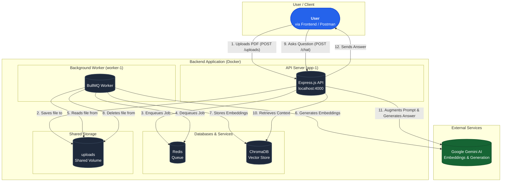

# Insight Engine

This is the backend for **Insight Engine**, an intelligent application designed to transform a collection of documents into a conversational knowledge base. It allows a user to upload documents (e.g., PDFs), and then ask questions in natural language to receive AI-powered answers based on the information contained within those documents.

The system is built as a multi-container application orchestrated with Docker Compose, ensuring a clean separation of concerns and a production-ready setup.

## System Architecture

The application operates using a **Retrieval-Augmented Generation (RAG)** architecture.

- **API Server (`app`)**: An Express.js server that handles incoming requests. It manages file uploads, adds processing jobs to the queue, and exposes the chat endpoint to the user.
- **Worker (`worker`)**: A background service using BullMQ that processes long-running tasks. It listens for jobs from the queue, extracts text from documents, generates vector embeddings using the Gemini API, and stores them in ChromaDB.
- **Redis (`redis`)**: Acts as a high-speed message broker for the BullMQ task queue, facilitating communication between the API Server and the Worker.
- **ChromaDB (`chroma`)**: The vector database that stores the document embeddings. It enables efficient semantic search to find information relevant to a user's query.
- **Shared Volume (`uploads`)**: A Docker volume mounted to both the API Server and the Worker, allowing the server to save an uploaded file and the worker to access it for processing.

### How it Works (Step-by-Step)

1.  **Knowledge Ingestion**:

    - A user uploads PDF files to the `POST /api/v1/pdf/uploads` endpoint.
    - The API Server clears the old ChromaDB collection to start a fresh session.
    - It adds a job for each file to the Redis queue.
    - The Worker picks up each job, processes the PDF, creates chunks, generates embeddings with the Gemini API, and stores them in ChromaDB.
    - The worker then deletes the temporary file from the shared volume.

2.  **Knowledge Retrieval**:
    - A user sends a question to the `POST /api/v1/pdf/chat` endpoint.
    - The API Server queries ChromaDB to retrieve the most relevant text chunks based on the question's meaning.
    - It _augments_ a prompt by combining this retrieved context with the original question.
    - This detailed prompt is sent to the Gemini generative model.
    - The model _generates_ a final answer based on the provided context, which is then sent back to the user.

## Project Setup & How to Run

1.  **Clone the Repository**

    ```bash
    git clone https://github.com/kyawzinthant-coding/insight-engine.git
    cd insight-engine
    ```

2.  **Create Environment File**
    Create a `.env` file in the root directory and add your configuration.

    ```env
    # Server Port
    PORT=4000

    # Redis Configuration for Docker
    REDIS_HOST=redis
    REDIS_PORT=6379

    # ChromaDB Configuration for Docker
    CHROMA_HOST=chroma
    CHROMA_PORT=8000

    # Your Gemini API Key
    GEMINI_API_KEY=AIzaSy...
    ```

3.  **Run with Docker Compose**
    Make sure you have Docker Desktop running. Then, from the project root, run:

    ```bash
    docker-compose up --build
    ```

    This command will build the Docker images and start all the necessary services (`app`, `worker`, `redis`, `chroma`).

4.  **Interact with the API**
    - **Upload Files:** Send a `POST` request with `form-data` to `http://localhost:4000/api/v1/pdf/uploads`. The key for your files should be `files`.
    - **Chat:** Send a `POST` request with a JSON body to `http://localhost:4000/api/v1/pdf/chat`. The body should look like: `{ "question": "your question here" }`.

## Development

For local development with hot-reloading, create a `docker-compose.override.yml` file to mount your source code into the containers and use `nodemon` (as configured in your `package.json`). This allows changes to your code to be reflected instantly without rebuilding the image.

## Architecture Diagram


